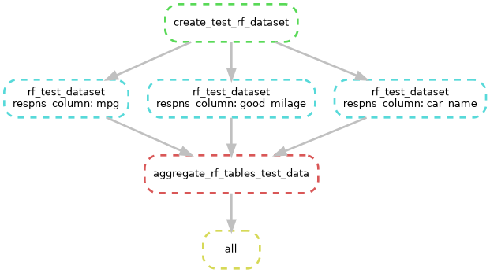

# Tutoral to demonstrate Snakemake to SCINET
## This repo holds files for demonstrating how snakemake can be used for automating data analysis on Ceres.
[Snakemake](https://snakemake.readthedocs.io/en/stable/index.html "Snakemake") is a python retooling of the old UNIX tool called "Make". It can be used to document and automatically run a pipeline. It can help run jobs in parallel. In this project, each column of a specific data table is run through a random forest script in parallel. 

The driver of action in Snakemake is the "rule". At minimum, a rule will have an input, which are files that trigger Snakemake to run the rule. Most rules will also have an output too, which will allow Snakemake to make a chain of actions based on inputs and outputs. A rule can run a command in the commandline or it can run python.

## Summary of what this pipeline does
### Rules
This pipeline can best be described by summarizing the rules, in the order that their actions are triggered:

* **rule create_test_rf_dataset**
    This rule will download the "MTCars" dataset using R. From that dataset, it will make a table of response variables that includes "mpg" as numeric values and "good_mileage" as a categorical variable. The predictor and response tables are saved to the data/unit_test directory.
* **rule rf_test_dataset:**
    Reads in the response columns one at a time to the random forest. The random forest makes a pdf graphic, saved to output/unit_test/graphics and and a table of the scikit learn scores (r squared for mgp and accuracy for good_mileage) in output/unit_test/tables. 
* **rule aggregate_rf_tables_test_data:**
    This rule tells Snakemake to look for the later output and then aggregates all the scores into a single file.
* **rule all**
    This is the final rule that only has input. It is used to call all the other rules. If you have multiple chains of rules, the end product will go here. Note that there is a convention to name this rule "all".
### Wildcards

Wildcards enable Snakemake to identify different files in the workflow. In the case of this pipeline, line 13 tells Snakemake what the different columns that we need to look for are:
`response_cols = ["mpg","good_mileage","car_name"]`

## Description of files
All of the Snakemake related files are found in the "workflow" directory.
Snakemake can be configured to be run on a variety of platforms and be customized for ease.
* **workflow/config/config.yaml**
    This file configures the defaults of snakemake. This one is configured to submit jobs to Slurm through the sbatch command. The sbatch for, example, will save the output and error messages to a project level directory called slurmLogs. ==**Each user should update the email address on line 14 and uncomment it.**==
* **workflow\env\snk_mk_conda_env.yml**
    This file tells Conda how to build the conda environment that is needed for the jobs in this demo. This project uses a single conda environment, but you could set up different conda envs for different rules.
* **workflow\Snakefile**
    This is the main file that gives the rules that Snakemake is to follow. Snakemake expects this file to be in the workflow directory.
## How to use this repository
First, load this repository to the desired location by either copy/pasting or navigating to the desired location and running the following command to clone through git:
`git clone https://github.com/palomnyk/SCINET_Snakemake_tutorial.git`
This will download the git repository.

`module load miniconda`
This loads the conda module into your envirTo install the conda environment for snakemake and the libraries for the pipelineoment. , run:

`conda env create --file workflow/env/snk_mk_conda_env.yml`

After fully loading, the output looks something like this:
```
Channels:
 - defaults
 - bioconda
Platform: linux-64
Collecting package metadata (repodata.json): done
Solving environment: done

==> WARNING: A newer version of conda exists. <==
    current version: 24.7.1
    latest version: 25.3.0

Please update conda by running

    $ conda update -n base -c defaults conda

Downloading and Extracting Packages:
                                                                                                                                                              
Preparing transaction: done                                                                                                                                   
Verifying transaction: \                                                                                                                                                         
done                                                                                                                                                          
Executing transaction: done                                                                                                                                   
#                                                          
# To activate this environmet,use                
#                                                  
#     $ conda activate snk_mk_conda_env                                     
#                                     
# To deactivate an active environment, use
#                                     
#     $ conda deactivate
```

`source activate snk_mk_conda_env`
This loads the conda environment that we just made. On other systems, "source" might be replaced with "conda"

Now that we are in the proper conda environment, we can test if Snakemake is working:
`snakemake --profile workflow/config -n`
This command performs a dry run of Snakemake using the config file in our config folder. It shows what rules need to be run in order to reach the "complete" rule. Note that it runs the rf_test_dataset rule 3 times.

```
Using profile workflow/config for setting default command line arguments.
Building DAG of jobs...
Conda environment workflow/env/snk_mk_conda_env.yml will be created.
Job stats:
job                              count
-----------------------------  -------
aggregate_rf_tables_test_data        1
complete                             1
create_test_rf_dataset               1
rf_test_dataset                      3
total                                6

Execute 1 jobs...

[Mon Mar 31 15:59:18 2025]
localrule create_test_rf_dataset:
    output: data/unit_test/mtc_predictor.csv, data/unit_test/mtc_response.csv
    jobid: 3
    reason: Missing output files: data/unit_test/mtc_response.csv, data/unit_test/mtc_predictor.csv
    resources: mem_mb=1000, mem_mib=954, disk_mb=<TBD>, tmpdir=<TBD>, partition=<TBD>, time=120, nodes=10, ntasks=5


                Rscript workflow/scripts/data_org/make_rf_test_dfs.R

Execute 3 jobs...

[Mon Mar 31 15:59:18 2025]
localrule rf_test_dataset:
    input: data/unit_test/mtc_predictor.csv, data/unit_test/mtc_response.csv
    output: output/unit_test/tables/1colmpg?rf_test_scores.csv
    jobid: 2
    reason: Missing output files: output/unit_test/tables/1colmpg?rf_test_scores.csv; Input files updated by another job: data/unit_test/mtc_response.csv, data/unit_test/mtc_predictor.csv
    wildcards: respns_column=mpg
    resources: mem_mb=1000, mem_mib=954, disk_mb=<TBD>, tmpdir=<TBD>, partition=<TBD>, time=120, nodes=10, ntasks=5


                python workflow/scripts/ml/random_forest.py                             --response_fn data/unit_test/mtc_response.csv                           --delimeter ,                           --pred_path data/unit_test/mtc_predictor.csv                            --out_folder unit_test                 --output_label rf_test                           --title rf_test                                 --response_col mpg


[Mon Mar 31 15:59:18 2025]
localrule rf_test_dataset:
    input: data/unit_test/mtc_predictor.csv, data/unit_test/mtc_response.csv
    output: output/unit_test/tables/1colgood_mileage?rf_test_scores.csv
    jobid: 4
    reason: Missing output files: output/unit_test/tables/1colgood_mileage?rf_test_scores.csv; Input files updated by another job: data/unit_test/mtc_response.csv, data/unit_test/mtc_predictor.csv
    wildcards: respns_column=good_mileage
    resources: mem_mb=1000, mem_mib=954, disk_mb=<TBD>, tmpdir=<TBD>, partition=<TBD>, time=120, nodes=10, ntasks=5


                python workflow/scripts/ml/random_forest.py                             --response_fn data/unit_test/mtc_response.csv                           --delimeter ,                           --pred_path data/unit_test/mtc_predictor.csv                            --out_folder unit_test                 --output_label rf_test                           --title rf_test                                 --response_col good_mileage


[Mon Mar 31 15:59:18 2025]
localrule rf_test_dataset:
    input: data/unit_test/mtc_predictor.csv, data/unit_test/mtc_response.csv
    output: output/unit_test/tables/1colcar_name?rf_test_scores.csv
    jobid: 5
    reason: Missing output files: output/unit_test/tables/1colcar_name?rf_test_scores.csv; Input files updated by another job: data/unit_test/mtc_response.csv, data/unit_test/mtc_predictor.csv
    wildcards: respns_column=car_name
    resources: mem_mb=1000, mem_mib=954, disk_mb=<TBD>, tmpdir=<TBD>, partition=<TBD>, time=120, nodes=10, ntasks=5


                python workflow/scripts/ml/random_forest.py                             --response_fn data/unit_test/mtc_response.csv                           --delimeter ,                           --pred_path data/unit_test/mtc_predictor.csv                            --out_folder unit_test                 --output_label rf_test                           --title rf_test                                 --response_col car_name

Execute 1 jobs...

[Mon Mar 31 15:59:18 2025]
localrule aggregate_rf_tables_test_data:
    input: output/unit_test/tables/1colmpg?rf_test_scores.csv, output/unit_test/tables/1colgood_mileage?rf_test_scores.csv, output/unit_test/tables/1colcar_name?rf_test_scores.csv
    output: output/unit_test/tables/rf_test_scores.csv
    jobid: 1
    reason: Missing output files: output/unit_test/tables/rf_test_scores.csv; Input files updated by another job: output/unit_test/tables/1colmpg?rf_test_scores.csv, output/unit_test/tables/1colcar_name?rf_test_scores.csv, output/unit_test/tables/1colgood_mileage?rf_test_scores.csv
    resources: mem_mb=1000, mem_mib=954, disk_mb=<TBD>, tmpdir=<TBD>, partition=<TBD>, time=120, nodes=10, ntasks=5


                echo "output/unit_test/tables/1colmpg?rf_test_scores.csv output/unit_test/tables/1colgood_mileage?rf_test_scores.csv output/unit_test/tables/1colcar_name?rf_test_scores.csv"
                Rscript workflow/scripts/data_org/combine_rf_data.R --out_subdir unit_test --fn_root rf_test

Execute 1 jobs...

[Mon Mar 31 15:59:18 2025]
localrule all:
    input: output/unit_test/tables/rf_test_scores.csv
    jobid: 0
    reason: Input files updated by another job: output/unit_test/tables/rf_test_scores.csv
    resources: mem_mb=1000, mem_mib=954, disk_mb=<TBD>, tmpdir=<TBD>, partition=<TBD>, time=120, nodes=10, ntasks=5

Job stats:
job                              count
-----------------------------  -------
aggregate_rf_tables_test_data        1
complete                             1
create_test_rf_dataset               1
rf_test_dataset                      3
total                                6

Reasons:
    (check individual jobs above for details)
    input files updated by another job:
        aggregate_rf_tables_test_data, complete, rf_test_dataset
    output files have to be generated:
        aggregate_rf_tables_test_data, create_test_rf_dataset, rf_test_dataset

This was a dry-run (flag -n). The order of jobs does not reflect the order of execution.
```

Finally, to actually run Snakemake, we just need to drop the -n flag:
`snakemake --profile workflow/config`
This should give similar output, but with job id numbers.

## Other useful commands
* `snakemake --rulegraph |dot -Tpng > workflow/reports/rulegraph.png`
    Used to make first graphic that shows order of rule execution.
* `snakemake --dag |dot -Tpng > workflow/reports/dag.png`
    Used to make the 2nd graphic that show a more detailed graphic.
### Tuturial setup
* git clone https://github.com/palomnyk/SCINET_Snakemake_tutorial
* conda env create --file workflow/env/snk_mk_conda_env.yml -p ./.conda

## Other useful resources
* https://github.com/jdblischak/smk-simple-slurm/blob/main/simple/config.v8%2B.yaml#L5
* https://github.com/binder-project/example-conda-environment

