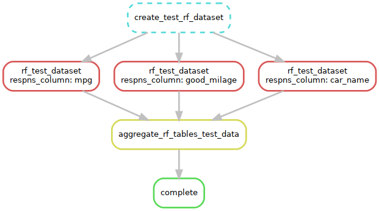

# Overview
Snakemake is a popular workflow management tool that can help [organize, document, scale, run, and reproduce](https://slides.com/johanneskoester/snakemake-tutorial "Snakemake slides") your workflows.
 Its workflows are described via a human readable, Python based language, but is language agnostic, and can be integrated into the SCINET HPC system via SLURM and CONDA.
In this workshop, Aaron Yerke will introduce the basics of a Snakemake workflow and demonstrate how it runs on the cluster. After attending this workshop, you should be able to integrate Snakemake into your own projects on the SCINET HPC. This repository can also be found at https://github.com/palomnyk/SCINET_Snakemake_tutorial.git.
  <!--excerpt-->

## Pre-Workshop Instructions

To help minimize technical issues and delays at the start of the workshop, please try the following prior to the workshop. 

* **Logging on to [Ceres Open OnDemand (OOD)](http://ceres-ood.scinet.usda.gov/):** Please confirm you can successfully log in to Ceres OOD with your SCINet account [(see instructions here)]({{site.baseurl}}/guides/access/web-based-login). If you are successful, you will be able to see the Ceres OOD home page.
* **Ceres Shell Access:** When on Ceres OOD, click on the top navigation bar: “Clusters” > “Ceres Shell Access”. A new tab will appear that looks like a shell terminal (e.g., like PowerShell). Please confirm you do not receive any error messages or requests to re-authenticate and that the final line looks like "[firstname.lastname@ceres ~]$” 
* **VS Code Server:** Back on the main Ceres OOD tab, click on the top or side navigation bar: “Interactive Apps” > “VS Code Server”. 
  * Fill the input fields with the following (input fields not listed below can be left at their default values):  
    * Account: scinet_workshop2 #TODO
    * Queue: ceres 
    * QOS: 400thread 
    * R Version: 4.4.1 
    * Number of hours: 5 #TODO too much?
    * Number of cores: 1 
    * Memory required: 8GB 
    * Optional Slurm Arguments: (leave empty) 
  * Click the "Launch" button. 
  * Wait a moment for the job card to update from "Queued" to "Running". 
  * Please confirm that clicking on the “Connect to VS Code Server” button opens a new tab with the VS Code Server interface. 

## Tutorial Setup Instructions 

Steps to prepare for the tutorial session: 

* Login to [Ceres Open OnDemand](http://ceres-ood.scinet.usda.gov/). For more information on login procedures for web-based SCINet access, see the [SCINet access user guide]({{site.baseurl}}/guides/access/web-based-login). 
* Open a command-line session by clicking on “Clusters” -> “Ceres Shell Access” on the top menu. This will open a new tab with a command-line session on Ceres' login node. 
* Request resources on a compute node by running the following command.  

    {:.copy-code}
    ```bash
srun --reservation=wk1_workshop -A scinet_workshop2 -t 05:00:00 -n 1 --mem 8G --pty bash 
```
    #TODO check this

* Create a workshop working directory by running the following commands. Note: you do not have to edit the commands with your username as it will be determined by the $USER variable.  

{:.copy-code}
```bash
mkdir -p /90daydata/shared/$USER/snakemake_ws 
cd /90daydata/shared/$USER/snakemake
cp -r /project/scinet_workshop2/Bioinformatics_series/wk1_workshop/day1/ . #TODO Where to store it?
```
-----  

## Tutorial Introduction
[Snakemake](https://snakemake.readthedocs.io/en/stable/index.html "Snakemake") is a python retooling of the old UNIX tool called "Make". It can be used to document and automatically run a pipeline and can help run jobs in parallel. 

The main driver of action in Snakemake is the "rule". At minimum, a rule will have an input, which are files that trigger Snakemake to run the rule. Most rules will also have an output too, which will allow Snakemake to make a chain of actions based on inputs and outputs. A rule can run a command in the commandline or it can run python. Variables that are passed from rule to rule are called wildcards. Wildcards are valueable tools for adding parallel processes to the the workflow. See more at: [Snakemake Logic](#snakemake-logic)

Snakemake can be customized for various types of system infrastructure. In this tutorial, we will set up Snakemake to submit jobs to SLURM and have those jobs run in specific Conda environments. The details of how each job will run are going to be given in a config file (workflow/config/config.yaml) and in the Snakefile file, which directs Snakemake on how to run jobs.

In this sample project, we will download the famous MTCars dataset, organize it, create a predictive model, and organize the output of the model. This will demonstrate how to use Snakemake to process each column of a specific data table is run in parallel. In this tutorial we will use the command line to set up Snakemake and then use Snakemake to run an example pipeline that consists of R and Python scripts. 
    
-----
## Snakemake logic

The instructions to Snakemake for running the pipeline are typically found in /workflow/Snakemake. This file contains the rules that Snakemake is meant to follow as well as links to config files.

{:.copy-code}
```bash
cat workflow/Snakefile
```

The rules in the file are prepened by the keyword "rule" and given a unique and descriptive name. Most of them have input and output designations. The inputs and outputs help Snakemake build a Directed Acyclic Graph of the rules in the graph (DAG) to create the workflow.

Wildcards are designated by curly brackets "{}" and the name of the wildcard in the input and output sections of the word. In the shell command section of the rule, the name of the wildcard must be prefixed with "wildcard.".

### Our rules
This pipeline can best be described by summarizing the rules, in the order that their actions are triggered:

* **rule create_test_rf_dataset**
    This rule will download the "Cars" dataset using R. From that dataset, it will make a table of response variables that includes "mpg" as numeric values and "good_mileage" as a categorical variable. The predictor and response tables are saved to the data/unit_test directory.
* **rule rf_test_dataset:**
    Reads in the response columns one at a time to the random forest. The random forest makes a pdf graphic, saved to output/unit_test/graphics and and a table of the scikit learn scores (r squared for mgp and accuracy for good_milage) in output/unit_test/tables. 
* **rule aggregate_rf_tables_test_data:**
    This rule tells Snakemake to look for the later output and then aggregates all the scores into a single file.
* **rule Complete**
    This is the final rule that only has input. It is used to call all the other rules. If you have multiple chains of rules, the end product will go here. Note that there is a convention to name this rule "all".

### Our wildcards
Wildcards enable Snakemake to identify and keep track of different files in the workflow. Our wildcards are defined on line 13 of the Snakefile as 
`response_cols = ["mpg","good_milage","car_name"]`
These wildcards are the column names of data/unit_test/mtc_response.csv that we download in **rule create_test_rf_dataset**. You will notice that intermediate files for this workflow use those wildcards in the filenames.


### Configuation

The main file for configuring Snakemake to your system architecture is: 

### Additional rule components
#### Conda
Snakemake can execute rules in specified conda environments. The environments should be specified in the optional "conda:" header. 

`conda:"env/snk_mk_conda_env.yml",`

In this specific project only one conda environment is used, but as many as needed can be used. Snakemake expects the Conda environment YAML to be found in the workflow/env folder.

{:.copy-code}
```bash
cat workflow/env/snk_mk_conda_env.yml
```

#### Resources
Default resources are allocated in workflow/config/config.yaml, but for a given rule, these resources can modified for individual rules with a resources block. In the example below, a custom runtime and memory allotment would be requested when this rule is submitted to SLURM.

```
	resources:
		runtime=240, #format: M, M:S, H:M:S, D-H, D-H:M, or D-H:M:S
		mem_mb="16gb"
```

#### Run
Finally, Instead of running commands with shell(), Snakemake can execute Python code with the run() command. For examples of this, see [Snakemake's plain python rules](https://snakemake.readthedocs.io/en/stable/snakefiles/rules.html#plain-python-rules "Snakemake's plain python rules")  


## Additional resources

